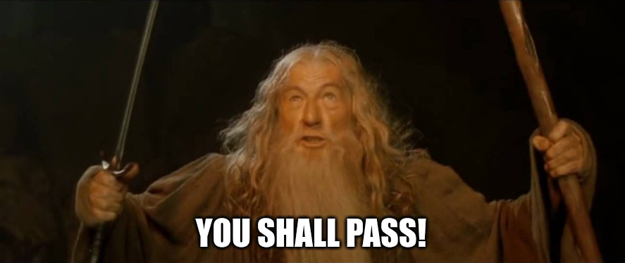

# FCSC 2025 La revanche de Sauron

Humilié par votre première victoire, Sauron a renforcé ses mesures de sécurité. Trouvant répugnante l’idée de se séparer de son chiffrement à base d’anneau, il a convenu avec ses sous-fifres d’un changement d’anneau après chaque chiffrement. Pleinement confiant en sa nouvelle création, il échange des messages cruciaux avec ses plus fidèles serviteurs.

Les elfes ont su capter un écrit mystérieux, chiffré cette fois-ci avec un anneau unique. Saurez-vous de nouveau montrer à Sauron que même le plus puissant des Seigneurs Ténébreux peut être vaincu ?

Auteurs : graniter / Cryptanalyse

Origine : [La revanche de Sauron](https://hackropole.fr/fr/challenges/crypto/fcsc2025-crypto-la-revanche-de-sauron/)

## Challenge
[files/output.txt](files/output.txt)
[files/la-revanche-de-sauron.py](files/la-revanche-de-sauron.py)

-----------

## Installation manuel
Vous n'utilisez pas l'application **les CTFs de Cyrhades** ? C'est dommage !
Mais voici comment installer ce CTF manuellement :

> git clone https://github.com/Hack-Oeil/fcsc2025-crypto-la-revanche-de-sauron.git

> cd fcsc2025-crypto-la-revanche-de-sauron

> docker compose up

-----------

## Sur le site officiel hackropole.fr
> https://hackropole.fr/fr/challenges/crypto/fcsc2025-crypto-la-revanche-de-sauron/
